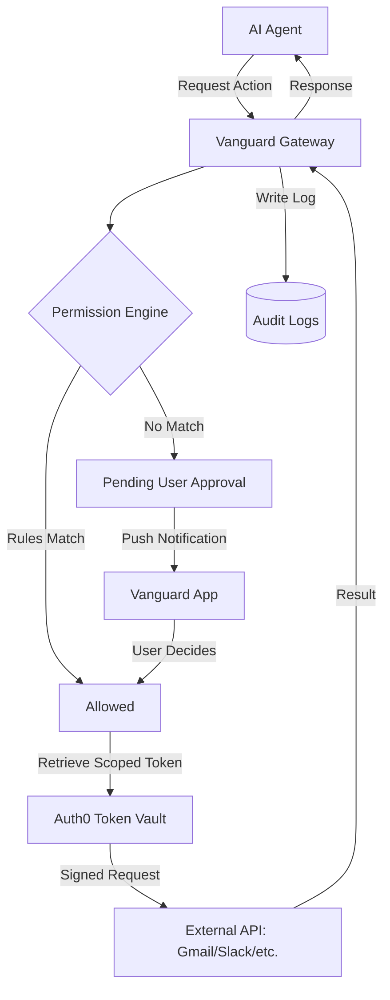

#  Vanguard

### Secure AI Action Proxy with Permission Intelligence

---

## 🧠 The Problem

As AI agents become more autonomous, they increasingly need to act on behalf of users—sending emails, managing calendars, or accessing sensitive data. However, letting an AI directly touch real-world APIs is a security nightmare. There is no fine-grained control, no audit trail, and no user-in-the-loop mechanism for high-stakes actions.

## 🛡️ The Vanguard Solution

**Vanguard** is a secure intermediary layer designed for the AI era. It intercepts every action an AI agent attempts, evaluates it against a robust permission engine, and securely executes it using Auth0-powered token vaulting.

- **Stop Uncontrolled AI Actions**: Every API call is gated.
- **User-Authored Decisions**: Users decide if an action is "Allowed Once", "Always Allowed", or "Denied".
- **Zero-Trust Execution**: The AI never sees your Gmail/Slack tokens. Vanguard handles the execution securely.

---

## 🔥 Key Features

### 🔐 1. Auth0-Powered Identity Layer

Vanguard uses **Auth0** for seamless, enterprise-grade authentication.

- **PKCE Flow**: Secure mobile authentication via native SDK.
- **Token Vault**: Securely stores and retrieves service-specific tokens (Gmail, Slack, etc.) without exposing credentials to the AI.

### 🛑 2. Permission Intelligence System

A rules-based engine that evaluates every request:

- **`allow_once`**: Temporary permission for a single request.
- **`allow_always`**: Permanent trust for low-risk operations.
- **`deny`**: Immediate blockage of sensitive actions.
- **Risk-Aware Escalation**: Automatically triggers step-up authentication for high-risk requests.

### 🧾 3. Audit & Transparency

Full traceability. Every decision (approved or denied) is logged with:

- **Action Type**: What the AI tried to do.
- **Context**: Who, when, and why.
- **Decision**: The outcome of the permission check.

---

## 🧱 Technical Architecture



---

## 🚀 Getting Started

### Prerequisites

- **Node.js** (v18+)
- **Expo Go** (for mobile development)
- **Auth0 Account** (configured for Native and Server applications)

### 1. Server Setup (NestJS)

```bash
# Navigate to server
cd server

# Install dependencies
npm install

# Configure your .env (Auth0 Domain, Client ID, Secret)
npm run start:dev
```

### 2. App Setup (Expo/React Native)

```bash
# Navigate to app
cd app

# Install dependencies
npm install

# Ensure you have your Auth0 config in .env
npx expo start
```

---

## 🛠️ Tech Stack

- **Mobile**: [Expo](https://expo.dev/), [React Native](https://reactnative.dev/), [NativeWind](https://nativewind.dev/), [Zustand](https://docs.pmnd.rs/zustand/), [Auth0 Native SDK](https://github.com/auth0/react-native-auth0).
- **Backend**: [NestJS](https://nestjs.com/), TypeScript, [Axios](https://axios-http.com/).
- **Security**: [Auth0](https://auth0.com/) (Identity, Token Vaulting, JWT).

---

## 🗺️ Roadmap

- [ ] **AI-Powered Risk Scoring**: Real-time evaluation of action complexity.
- [ ] **Expanded Integrations**: One-click connect for Zapier and IFTTT.
- [ ] \*\*Fleet
