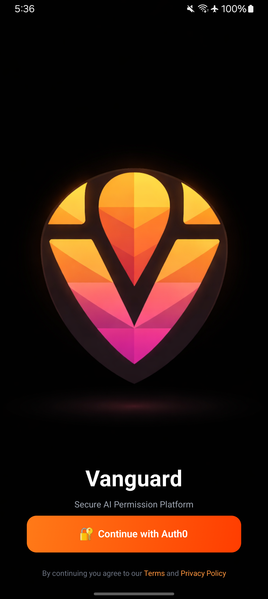
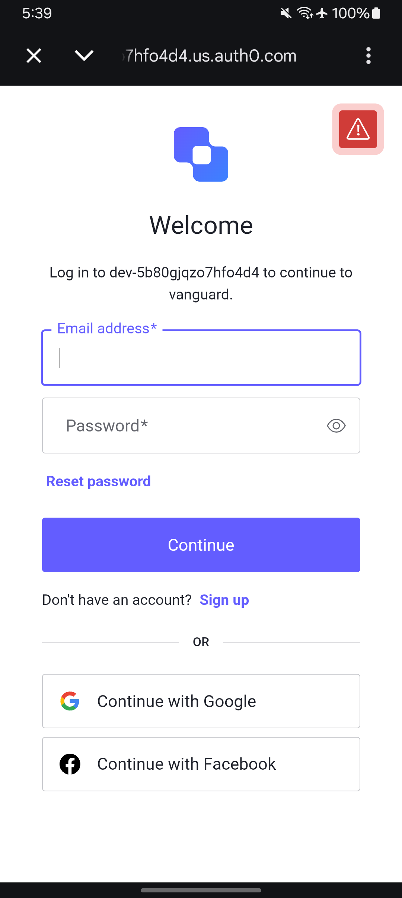
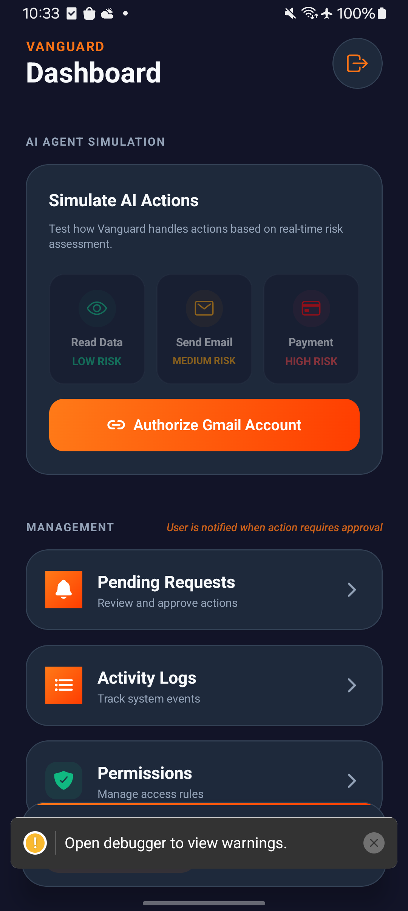
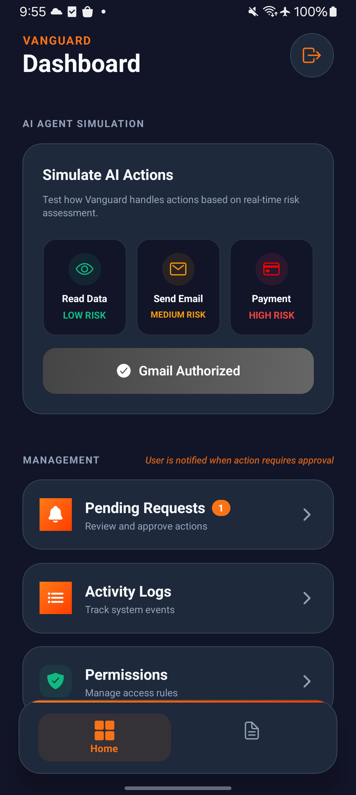
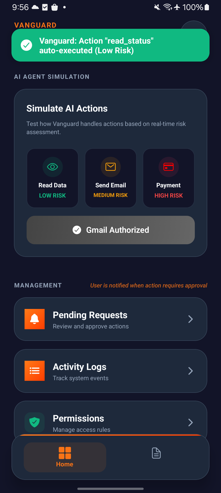
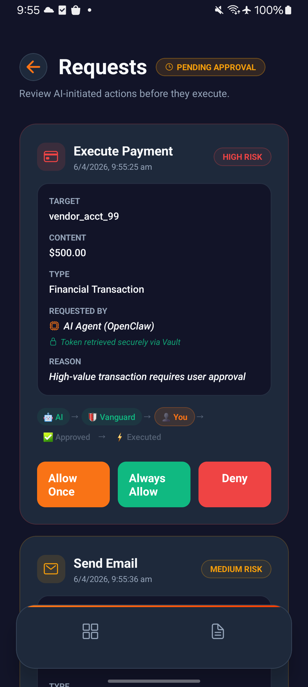
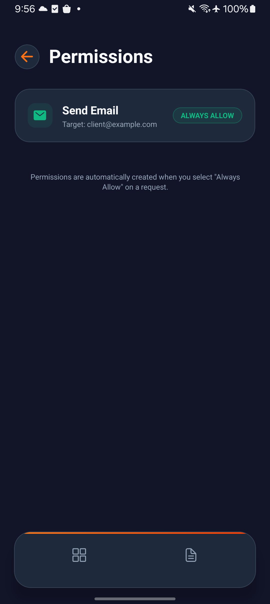
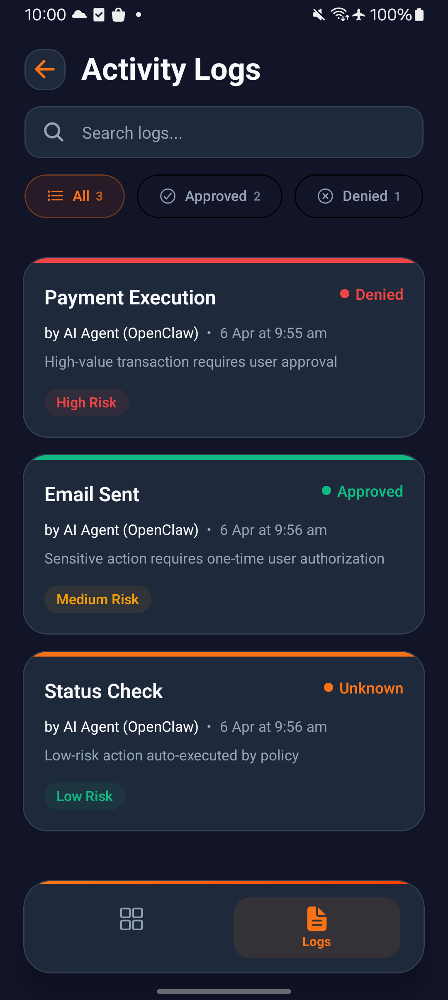
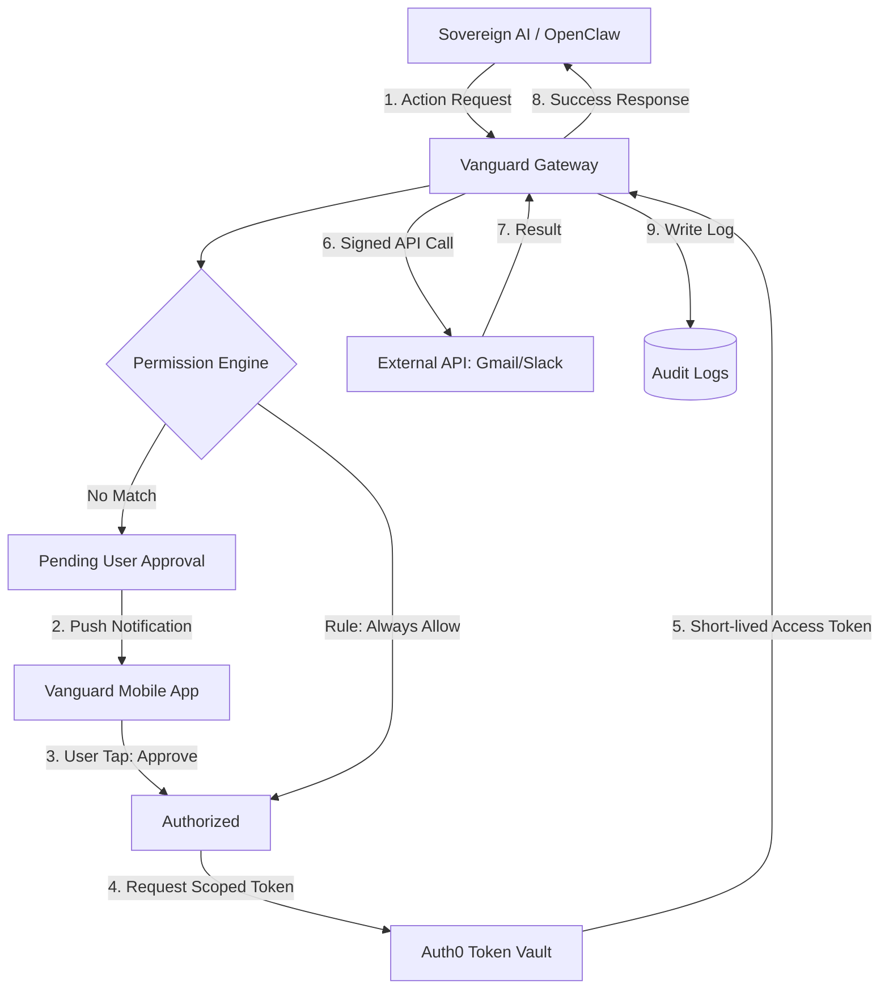

#  Vanguard

### The Permission Layer for Sovereign AI Agents

**Secure Intermediary Proxy | Permission Intelligence | Auth0 Token Vault Integration**

---

## 🧠 The Problem

AI agents increasingly act on behalf of users—sending emails, accessing data, and triggering real-world actions. However, letting an AI directly touch real-world APIs is a security nightmare. There is no runtime control, no audit trail, and no user approval for high-risk actions.

## 🛡️ The Vanguard Solution

**Vanguard** is a secure intermediary layer designed for the AI era. It intercepts every action an AI agent attempts, evaluates it against a robust permission engine, and securely executes it using **Auth0** for identity and a **Vault-based token access model**.

👉 **Vanguard transforms AI systems from execution-first → control-first.**

- **Stop Uncontrolled AI Actions**: Every API call is gated by default.
- **User-Authored Decisions**: Users decide if an action is "Allowed Once", "Always Allowed", or "Denied".
- **Zero-Trust Execution**: The AI never sees your Gmail/Slack tokens. Vanguard handles the execution securely.

---

## 📸 Screenshots

<div align="center"> 
 
 


<br/><br/>




<br/><br/>

 
 
 
</div>

---

## 🧪 Demo Flow

1. **User triggers** an AI action.
2. **Request** is sent to Vanguard backend.
3. **Permission engine** evaluates risk and matching rules.
4. **High-risk actions** require user approval (simulated via app notification).
5. **Token retrieved** securely from backend (Vault layer backed by Auth0 identity).
6. **Action executed** by Vanguard on behalf of the user.
7. **Logs updated** for full audit transparency.

---

## 🔐 Security Principle

Vanguard applies the **Principle of Least Privilege** to AI systems.

Instead of giving AI unrestricted access, every action is:

- **Explicitly authorized** by the user.
- **Scoped** to the specific task.
- **Executed** through a secure, isolated layer.

👉 This shifts AI systems from **implicit trust → explicit control**.

---

## 🔥 Key Features

### 🔐 1. Auth0-Powered Identity Layer

Vanguard uses **Auth0** for seamless, enterprise-grade authentication.

- **PKCE Flow**: Secure mobile authentication via native SDK.
- **Token Vault**: Securely stores and retrieves service-specific tokens (Gmail, Slack, etc.).
- **👉 Tokens are never exposed to the AI agent or frontend**—only Vanguard can access them after authorization.

### 🛑 2. Permission Intelligence System

A rules-based engine that evaluates every request:

- **`allow_once`**: Temporary permission for a single request.
- **`allow_always`**: Permanent trust for low-risk operations.
- **`deny`**: Immediate blockage of sensitive actions.
- **Risk-Aware Escalation**: Automatically triggers step-up authentication for high-risk requests.

### 🧾 3. Audit & Transparency

Full traceability. Every decision (approved or denied) is logged with:

- **Action Type**: What the AI tried to do.
- **Context**: Who, when, and why.
- **Decision**: The outcome of the permission check.

---

## 🏗️ Technical Architecture



---

## 🛠️ Tech Stack

- **Mobile:** [Expo](https://expo.dev/) (React Native) with [NativeWind](https://nativewind.dev/) (Tailwind CSS) for a modern, responsive UI.
- **Backend:** [NestJS](https://nestjs.com/) (TypeScript) providing a robust, scalable REST API.
- **Identity:** [Auth0 for AI Agents](https://auth0.com/) (Token Vault, M2M Authentication, Native SDK).
- **AI Logic:** OpenAI GPT-4o-mini (used exclusively for intent parsing into JSON).

---

## 🚀 Getting Started

### Prerequisites

- Node.js (v18+)
- Expo Go on your mobile device
- An Auth0 Tenant with Token Vault enabled

### 1. Backend Setup

```bash
cd server
npm install
# Configure .env with AUTH0_DOMAIN, CLIENT_ID, and VAULT_API_URL
npm run start:dev
```

### 2. Mobile App Setup

```bash
cd app
npm install
npx expo start
```

---

## 🗺️ Roadmap

- [ ] **Biometric Gates:** Require FaceID/TouchID for every Token Vault retrieval.
- [ ] **Dynamic Scoping:** Automatically narrow token scopes based on the specific AI prompt.
- [ ] **Multi-Agent Support:** Unique permission profiles for different AI models (e.g., GPT-4 vs. local Llama).

---

## 🔮 Future Work

- [ ] **Biometric Gates**: Require FaceID/TouchID for every Token Vault retrieval.
- [ ] **Dynamic Scoping**: Automatically narrow token scopes based on specific AI intent.
- [ ] **Multi-Agent Support**: Unique permission profiles for different models (e.g., GPT-4 vs. local Llama).

---

## ⚡ Why This Matters

AI systems today prioritize execution over safety. Vanguard introduces the missing layer of:

- **Control**: Real-time gating of sensitive actions.
- **Security**: Zero-exposure token management.
- **Accountability**: Immutable audit logs of every AI decision.

👉 **Enabling safe, controllable AI in real-world, high-stakes environments.**

## Note on Contributions

This project was built independently by me (Nisar Ahmed).

The repository shows multiple contributors due to commits made from different Git configurations/accounts, but all contributions are from the same individual and are not affiliated with any employer.
